# PRISM: Physics-Representation Interpretability for PDE-Constrained Engineering Design

> **Integrating Scientific Machine Learning (SciML), Sparse Autoencoders, and PDE-Constrained Interventions**

---

## 1. Executive Summary & Paradigm

Modern PDE-constrained topology optimization (such as SIMP or inverse-design nanophotonic frameworks like **HiLAB**) can discover highly complex spatial layouts \(\rho^\star(x)\) that achieve optimal physical performance \(J[u,\rho]\).

However, these optimized geometries act as black-box solutions rather than human-understandable explanations: an engineer cannot easily discern *why* a particular intricate channel, void, or branching fin was formed, nor *which* structural components can be modified without causing severe degradation in physical behavior.

**PRISM** bridges this gap by discovering interpretable, disentangled geometric primitives directly from SciML latent representations, and rigorously verifying their physical significance through **causal interventions evaluated via governing PDEs**.

```mermaid
graph LR

    A["PDE Optimization Dataset<br/>{ρ*ₘ}"] --> B["Base Autoencoder<br/>z = φ(ρ*)"]

    B --> C["Sparse Autoencoder (SAE)<br/>f = ReLU(Wₑ(z-b_d) + bₑ)"]

    C --> D["Intervention Iₖ(f)<br/>f̃ₖ = fₖ + Δ"]

    D --> E["Modified Geometry<br/>ρ̃ = φ⁻¹(W_d f̃ + b_d)"]

    E --> F["Forward PDE Solve<br/>-∇·(κ(ρ̃)∇ũ) = f"]

    F --> G["Physical Response<br/>ũ & Performance J̃"]

    style A fill:#1e293b,stroke:#38bdf8,color:#f8fafc
    style C fill:#312e81,stroke:#818cf8,color:#f8fafc
    style D fill:#701a75,stroke:#f0abfc,color:#f8fafc
    style F fill:#064e3b,stroke:#34d399,color:#f8fafc
    style G fill:#78350f,stroke:#fbbf24,color:#f8fafc
```



### The PRISM Interpretability Triad

$$
\boxed{
\text{Geometry }(\rho)
\quad\Longleftrightarrow\quad
\text{Representation }(z,f_k)
\quad\Longleftrightarrow\quad
\text{Physics }(u,J)
}
$$

---

# 2. Mathematical Formulation

## 2.1 Forward PDE & Governing Physics

Consider a spatial domain

$$
\Omega \subset \mathbb{R}^2
$$

discretized on an \(N_x \times N_y\) mesh.

Let the design field be a static material density distribution:

$$
\rho : \Omega \longrightarrow [0,1].
$$

The steady-state heat conduction (Poisson-type) governing PDE is

$$
-\nabla \cdot \left( \kappa(\rho)\nabla u \right)
=
f(x,y)
\qquad \text{in } \Omega,
$$

subject to Dirichlet thermal sink boundary conditions

$$
u = 0
\qquad \text{on } \partial\Omega_{\text{sink}},
$$

and insulated Neumann conditions

$$
\frac{\partial u}{\partial n}=0
\qquad \text{elsewhere}.
$$

### Material Interpolation (SIMP Model)

To penalize intermediate non-physical densities \(\rho\in(0,1)\), the local thermal conductivity is modeled using the Solid Isotropic Material with Penalization (SIMP) interpolation scheme:

$$
\kappa(\rho)
=
\kappa_{\min}
+
\left(
\kappa_{\max}-\kappa_{\min}
\right)\rho^p.
$$

The parameters are

$$
\kappa_{\min}=10^{-3},
\qquad
\kappa_{\max}=1.0,
\qquad
p=3.0.
$$

### Thermal Compliance / Physical Performance

The overall physical performance is quantified by the total thermal compliance

$$
J[u,\rho]
=
\int_{\Omega} f\,u\,dx.
$$

Using the governing PDE, this can equivalently be written as

$$
J[u,\rho]
=
\int_{\Omega}
\kappa(\rho)
\left|\nabla u\right|^2
\,dx.
$$

In discrete form:

$$
J[u,\rho]
=
\mathbf{u}^{T}
\mathbf{K}(\rho)
\mathbf{u}.
$$

A **lower** compliance \(J\) indicates superior thermal dissipation and therefore better heat-sink performance under this objective.

---

## 2.2 SciML Base Representation & Sparse Autoencoder (SAE)

### Base Spatial Autoencoder

A 2D convolutional autoencoder encodes spatial design fields

$$
\rho \in [0,1]^{H\times W}
$$

into a low-dimensional latent representation

$$
z\in\mathbb{R}^{d}.
$$

The encoder is

$$
z=\phi(\rho),
$$

while the decoder reconstructs the geometry as

$$
\hat{\rho}=\phi^{-1}(z).
$$

---

### Sparse Autoencoder

Following the sparse dictionary-learning approach of Bricken et al. (Anthropic, 2023), dense latent vectors may contain overlapping combinations of structural concepts.

The SAE maps the dense latent representation into an overcomplete sparse feature dictionary with dimension

$$
K \gg d.
$$

The feature representation is

$$
f(z)
=
\operatorname{ReLU}
\left(
W_e(z-b_d)+b_e
\right)
\in\mathbb{R}^{K}.
$$

The reconstructed latent vector is

$$
\hat{z}(f)
=
W_d f+b_d
\in\mathbb{R}^{d}.
$$

### SAE Objective Function

The SAE loss combines normalized reconstruction error with an \(L_1\) sparsity penalty:

$$
\mathcal{L}_{\mathrm{SAE}}
=
\frac{1}{d}
\left\|
z-\hat{z}
\right\|_2^2
+
\lambda
\sum_{k=1}^{K}
|f_k|.
$$

The decoder dictionary vectors are normalized after every gradient step:

$$
\left\|
W_{d,k}
\right\|_2
=
1,
\qquad
\forall k\in\{1,\ldots,K\}.
$$

---

# 2.3 Controlled Interventions & Causal Physics Testing

To determine whether a sparse feature \(f_k\) captures a physically meaningful geometric primitive—such as a primary conductive spine or secondary cooling fin—PRISM applies controlled interventions.

### Step 1 — Feature Intervention

For boosting/amplification:

$$
\tilde{f}_k
=
f_k+\alpha.
$$

For ablation/suppression:

$$
\tilde{f}_k
=
0.
$$

More generally,

$$
\tilde{f}_j=f_j
\qquad
\text{for }j\neq k.
$$

---

### Step 2 — Latent Reconstruction

The intervened latent representation is reconstructed using the SAE decoder:

$$
\tilde{z}
=
W_d\tilde{f}+b_d.
$$

---

### Step 3 — Geometry Reconstruction

The modified latent representation is passed through the spatial decoder:

$$
\tilde{\rho}
=
\phi^{-1}(\tilde{z}).
$$

---

### Step 4 — Governing PDE Solve

The modified geometry defines a new thermal conductivity field

$$
\kappa(\tilde{\rho}).
$$

The forward PDE is then solved:

$$
-\nabla\cdot
\left(
\kappa(\tilde{\rho})
\nabla\tilde{u}
\right)
=
f.
$$

This produces the intervened physical state

$$
\tilde{u}.
$$

---

### Step 5 — Physical Performance Evaluation

Finally, the modified physical performance is evaluated:

$$
\tilde{J}
=
J[\tilde{u},\tilde{\rho}].
$$

The complete causal chain is therefore

$$
\boxed{
f_k
\longrightarrow
\tilde{\rho}
\longrightarrow
\tilde{u}
\longrightarrow
\tilde{J}
}
$$

This allows PRISM to connect an abstract latent feature directly to a measurable physical consequence.

---

# 3. Results & Visualizations

The end-to-end PRISM framework was trained and evaluated on **120 topology-optimized 2D heat-dissipation designs** generated using SIMP Optimality Criteria (OC).

### Generated Figures

1. **PDE Design Dataset**

   * `fig1_pde_dataset_samples.png`

2. **SAE Training Convergence & \(L_0\) Sparsity**

   * `fig2_sae_training_convergence.png`

3. **PRISM Triad Intervention Test**

   * `fig3_prism_triad_intervention.png`

---

## Key Empirical Findings

> **Monosemantic Feature Disentanglement**

The SAE dictionary learning configuration

$$
K=64,
\qquad
d=16
$$

compressed dense representations to an average of approximately

$$
L_0\approx2.4
$$

active features per design.

This corresponds to more than **96% sparsity** in the feature representation and was associated with localized geometric motifs such as central vertical heat channels and diagonal conductive fins.

---

> **Causal Physics Response**

### Feature #29 — Boosting

Boosting Feature #29 with

$$
\Delta f=+2.5
$$

thickens the primary thermal conduction path in the reconstructed geometry.

The measured thermal compliance changes from

$$
J_{\mathrm{orig}}=232.18
$$

to

$$
\tilde{J}=135.45.
$$

The corresponding relative change is

$$
\frac{\tilde{J}-J_{\mathrm{orig}}}
{J_{\mathrm{orig}}}
\times100\%
\approx
-41.66\%.
$$

Thus, under the stated objective and intervention, Feature #29 is associated with a substantial reduction in thermal compliance.

### Feature #29 — Ablation

Ablating Feature #29 sets

$$
f_{29}=0.
$$

The resulting geometry removes or weakens key heat-distribution branches, allowing the corresponding change in PDE performance to be measured directly.

---

# 4. Starter Code Repository Structure

The complete Python starter codebase is located at:

```text
c:/Vilohith/College/Pestourie_Research/PRISM
```

| File                        | Description                                                                                                                                                                                        |
| --------------------------- | -------------------------------------------------------------------------------------------------------------------------------------------------------------------------------------------------- |
| `prism/pde_solver.py`       | 2D finite-difference heat PDE solver (`HeatPDE2D`), SIMP topology optimizer (`SIMPOptimizer`), and dataset generator (`generate_pde_dataset`).                                                     |
| `prism/models.py`           | PyTorch implementations of `SpatialAutoencoder` (\(\phi\)) and `SparseAutoencoder` (SAE with \(L_1\) penalty and unit decoder-column normalization).                                               |
| `prism/interpretability.py` | `PRISMInterventionEngine`: feature activation statistics, monosemanticity ranking, and intervention simulator \(\mathcal{I}_k(f)\rightarrow\tilde{\rho}\rightarrow\tilde{u}\rightarrow\tilde{J}\). |
| `run_prism_demo.py`         | End-to-end runnable script executing dataset generation, AE/SAE training, intervention testing, and publication-figure export.                                                                     |

---

# 5. Execution Instructions

From a Conda-enabled environment, run:

```bash
cd c:\Vilohith\College\Pestourie_Research\PRISM

conda run -n quantum-transfer python run_prism_demo.py
```

The pipeline automatically performs:

1. PDE-constrained topology optimization
2. Dataset generation
3. Spatial autoencoder training
4. Sparse autoencoder training
5. Feature activation analysis
6. Feature interventions
7. Forward PDE solves
8. Physical-performance evaluation
9. Publication-figure generation

All generated figures and evaluation metrics are exported to:

```text
results/
```

---

# PRISM Summary

The central idea of PRISM is to establish an interpretable correspondence between three levels of a PDE-constrained engineering system:

$$
\boxed{
\text{Geometry}
\quad
\Longleftrightarrow
\quad
\text{Representation}
\quad
\Longleftrightarrow
\quad
\text{Physics}
}
$$

where

$$
\rho
\quad\Longleftrightarrow\quad
(z,f_k)
\quad\Longleftrightarrow\quad
(u,J).
$$

Rather than treating a topology-optimized design as an opaque solution, PRISM asks:

$$
\boxed{
\text{What geometric concept does feature }f_k\text{ represent?}
}
$$

and, more importantly,

$$
\boxed{
\text{What happens to the governing physics when }f_k\text{ is intervened upon?}
}
$$

This creates a physics-grounded interpretability framework in which learned representations can be tested through direct, quantitative interventions on the underlying PDE system.
